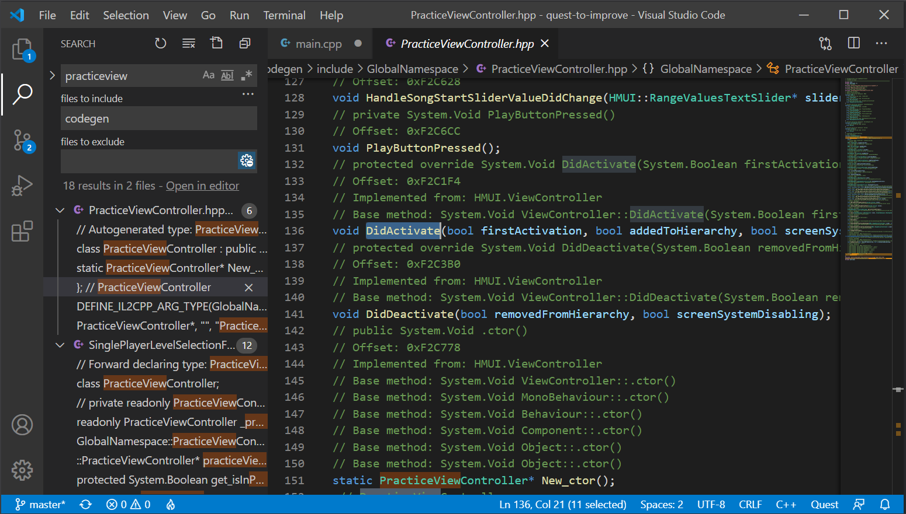
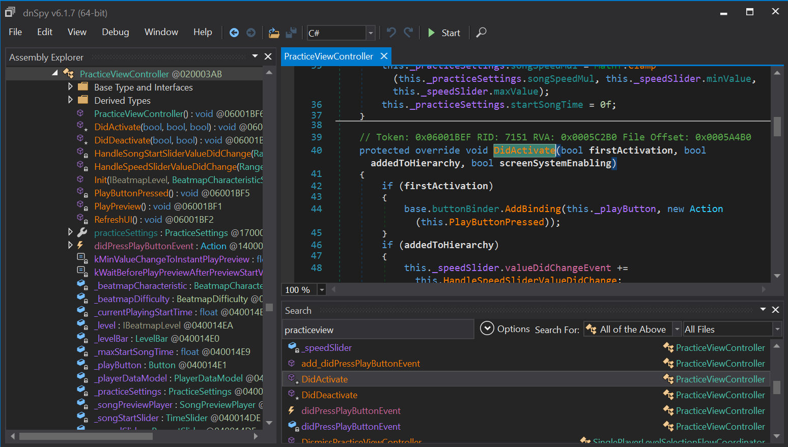

# Introduction to Modding Beat Saber for Oculus Quest

This guide is intended to serve as a starting point for writing your own mods for Beat Saber for Oculus Quest. The modding scene for Quest is fairly small and fast-moving, so certain tools, techniques, and best practices may quickly become outdated, and instructional guides can be hard to find. To successfully write mods you'll need to be scrappy and resourceful. The goal of this guide is to give you the tools to *find* the information you need, not necessarily to give you all the information.

Certain assumptions are made, like that you are at least vaguely familiar with software development, and can navigate a terminal. Most resources have been created with this in mind. Windows is not a hard requirement, but tools and build scripts referenced here are all designed for use on Windows, so being in that environment may make your life easier. Mods themselves are written in C++, and this guide does not aim to teach the language.

When in doubt, check out the [BSMG Discord #quest-mod-dev channel](https://discord.gg/beatsabermods), and try searching on Discord before asking questions. In addition, most mods posted on BSMG include their source code, and browsing through those sources is a great way to familiarize yourself with certain patterns and techniques.

Last updated: 4 February 2021, Beat Saber 1.13.2

**Table of Contents**
- [Prerequisites](#prerequisites)
  - [Oculus Quest setup](#oculus-quest-setup)
  - [Development environment](#development-environment)
- [Starting a new project](#starting-a-new-project)
  - [Using VSCode Project Templates](#using-vscode-project-templates)
  - [Without Project Templates](#without-project-templates)
- [Build scripts](#build-scripts)
- [Modding concepts](#modding-concepts)
  - [Hooks](#writing-hooks)
    - [Finding methods to hook](#finding-methods-to-hook)
      - [Browsing codegen headers](#browsing-codegen-headers)
      - [Dumping DLLs from the Quest](#dumping-dlls-from-the-quest)
      - [Browsing Quest or PC DLLs using dnSpy](#browsing-quest-or-pc-dlls-using-dnspy)
  - [il2cpp and codegen](#il2cpp-and-codegen)
  - [Unity engine](#unity-engine)
  - [custom-types](#custom-types)
  - [QuestUI](#questui)
- [Basic examples](#basic-examples)
  - [Modifying a gameplay attribute](#modifying-a-gameplay-attribute)
  - [Modifying a menu](#modifying-a-menu)
- [Going further](#going-further)
  - [Logging](#logging)
  - [Using codegen](#using-codegen)
  - [Sharing and distribution](#sharing-and-distribution)
    - [Distributing mods with dependencies](#distributing-mods-with-dependencies)
- [Links](#links)
  - [Tools and resources](#tools-and-resources)
  - [Example repositories](#example-repositories)

---

## Prerequisites

### Oculus Quest setup

Beat Saber should already be modded with the latest [BMBF](https://bmbf.dev/stable), with Developer Mode enabled on your Quest. You should also have [SideQuest](https://sidequestvr.com/setup-howto) installed on your computer, though if you've gotten BMBF installed without it then you likely do not need this guide.

**Tips and tricks**:
- To keep the Quest display from turning off when you remove it, you can place a piece of tape over the black sensor in the inside top-center of the headset, above the nose.
- Video can be streamed from your Quest to your computer through SideQuest to see the VR display without putting the headset on.
- Wireless debugging can be enabled through SideQuest to develop without the Quest plugged in. This will quickly drain your battery and is not recommended, but can be useful for play testing.
- Keep some extra AA batteries (or a batter charger!) handy, as your controllers will spend a lot of time drawing power while developing.


### Development environment

This guide assumes you're using [Visual Studio Code](https://code.visualstudio.com/), however it's not a hard requirement and plenty of modders use other IDEs, though some steps in this guide may differ. Note that, no matter your IDE, you may encounter some issues with Intellisense: when in doubt, double check your include paths and try refreshing your Intellisense cache (Ctrl+Shift+P > )

- [Android NDK](https://developer.android.com/ndk/downloads) must be installed. Note its path for project template setup later.
- [Android SDK](https://developer.android.com/studio/releases/platform-tools#downloads) is strongly recommended and this guide assumes it is present in your `PATH`. It's necessary for running `adb` commands.
- [qpm (Quest Package Manager)](https://github.com/sc2ad/QuestPackageManager) is required and should be in your `PATH`. *Note*: qpm releases can be found by going to Actions on GitHub, to the latest build, and downloading the appropriate artifact for your system.


---

## Starting a new project

We will start from [Lauriethefish's project template](https://github.com/Lauriethefish/quest-mod-template). It's made to use the VSCode [Project Templates extension by cantonios](https://marketplace.visualstudio.com/items?itemName=cantonios.project-templates). If you're using VSCode and the extension, see the next section ([Using VSCode Project Templates](#using-vscode-project-templates)), otherwise skip to the one after ([Without Project Templates](#without-project-templates))

### Using VSCode Project Templates

With the VSCode extension installed:
- Open the project templates folder (Ctrl+Shift+P > `Project: Open Templates Folder`) and extract the Quest mod template into a new folder inside the templates folder.
- Create a new empty folder for your project somewhere and open it in VSCode (File > `Open Folder...`)
- Create a project from the template (Ctrl+Shift+P > `Project: Create Project from Template`)
  - For `ndkpath`, add the path to your NDK _using forward slashes_.
  - `id` is the internal name of your mod (no spaces).
  - `name` is the readable name of your mod.
  - `author` is your name or handle.
  - `description` is a short description of your mod.

### Without Project Templates

- Extract the template ZIP into a new folder somewhere.
- For each `.ps1` file, right click > Properties > Check "Unblock" on the lower right. This will prevent a security confirmation every time you run one of the scripts.
- Find and replace each of the project template tags throughout the project:
  - Replace `#{ndkpath}` with the path to your NDK _using forward slashes_.
  - Replace `#{id}` with the internal name of your mod (no spaces).
  - Replace `#{name}` with the readable name of your mod.
  - Replace `#{author}` with your name or handle.
  - Replace `#{description}` with a short description of your mod.
- In case the template may be updated with additional tags, you may want to do an extra project wide search for the template tag format (e.g. `#\{([^}]+)\}` if you have regex search)

---

Once your project directory is set up and all template tags have been replaced.

- Run `qpm restore`. This will download the dependencies defined in `qpm.json`. When you add or change a dependency, rerun the command. See [the qpm repository](https://github.com/sc2ad/QuestPackageManager) for more information on using qpm.
- To run an initial test build, run `build.ps1`.

**Tips and tricks**:
- Commands can be run from a PowerShell terminal inside VSCode (Terminal > New Terminal or Ctrl+Shift+\`)


---

## Build scripts

- `build.ps1` will just build the mod (generates `.so` file) and nothing else. Useful for confirming code validity, but you may want to use other scripts to do more useful things with the build output.
- `buildBMBF.ps1` will build the mod and package it into a `.zip` that can be installed via BMBF. Once you are ready to share the mod with others, this is the thing you distribute.
- `copy.ps1` will build the mod and copy it directly to your Quest's mods directory (`/sdcard/Android/data/com.beatgames.beatsaber/files/mods`). Run `copy.ps1 --log` to begin logging from the Quest to your terminal after the files are copied and the game restarts.

---

## Modding concepts

Beat Saber is made using Unity and most of the game is written in C#. This C# is compiled down to C++ (thus the so-called "il2cpp"), and it's this bit which you can interface with to mod the game. [beatsaber-hook](https://github.com/sc2ad/beatsaber-hook) provides utilities to interact with this layer and the underlying C# code for both the game and the Unity engine.

At a high level, the modding process goes like this:
  - Find some game method(s) to hook, acting as a sort of entry point. Your code will be injected and executed when the hooked method is run.
  - Interact with the game code (largely in codegen's `GlobalNamespace`) and `UnityEngine` to make changes inside the game world.


### Hooks

Hooks are the primary way of interfacing with the game. You find a method that the game calls, and run some of your code whenever that method is called. The hooks themselves are written in two parts. First, you create the hook using the `MAKE_HOOK_OFFSETLESS` macro, then you install the hook using the `INSTALL_HOOK_OFFSETLESS` macro.

`MAKE_HOOK_OFFSETLESS` takes the args: `hook_name, return_type, ...args`, where `hook_name` is whatever you want it to be, `return_type` is the actual type that the original function returns, and `...args` is all of the arguments passed to the original method. When hooking an *instance method*, the first argument will always be a pointer to the class instance itself, and this self-reference is _not_ included in the number of args specified when installing the hook.

Hooks effectively replace the original function call, so you generally need to call the original function at some point in your hook. Make sure to return the appropriate type for the function you are hooking:
```c++
// For a void hook, just make sure to call the original at some point
MAKE_HOOK_OFFSETLESS(MyHook, void, Il2CppObject* self, SomeType arg1, SomeType arg2) {
  // your code here
  MyHook(self, arg1, arg2);
  // or here
}
// When the hooked function returns a value, make sure to return something of that type
MAKE_HOOK_OFFSETLESS(MyHook2, int, Il2CppObject* self, SomeType arg1, SomeType arg2) {
  int original_value = MyHook2(self, arg1, arg2);
  // your code here
  return original_value;
}
```

`INSTALL_HOOK_OFFSETLESS` is where you install your hook code to the correct place using `il2cpp`, so that it runs when it's supposed to. For this, you'll need to know the call path to the method, and the number of arguments it takes. If you want to hook `SomeNamespace::SomeClass::SomeMethod` which takes two args, then it'd look like this:
```c++
INSTALL_HOOK_OFFSETLESS(getLogger(), MyHook, il2cpp_utils::FindMethodUnsafe("SomeNamespace", "SomeClass", "SomeMethod", 2))
```

As an example to put these together, let's say you want to a hook a method in the `Foo` class called `SomeMethod` that returns a `float` and takes one `char*` argument:
```c++
MAKE_HOOK_OFFSETLESS(MyHook, float, Il2CppObject* self, char* some_arg) {
  /* do something */
  return MyHook(self, some_arg);
}
extern "C" void load() {
  INSTALL_HOOK_OFFSETLESS(getLogger(), MyHook, il2cpp_utils::FindMethodUnsafe("", "Foo", "SomeMethod", 1));
}
```

Note that when finding methods, nested namespaces use C#-style syntax: `FindMethodUnsafe("SomeNamespace.NestedNamespace", "ClassName", "MethodName", 0)`. In addition, game methods in `GlobalNamespace` take an empty string as the namespace argument, e.g. `FindMethodUnsafe("", "MainMenuViewController", "DidActivate", 3);`.

**Important note**: Mistakes in hook definitions and installation are a *very* common source of issues and crashes. If your game crashes on startup with a null pointer dereference after creating a new hook, double (and triple!) check that everything is correct, including the class name, method name, number of arguments (surprisingly easy to miscount), and the function signature of the hook itself. Even if your game doesn't crash, if you do not have the exact same function signature for your hook, weird things may happen!


#### Finding methods to hook

There are two main approaches to searching through the game's methods: by browsing the headers in codegen, or by browsing the game's DLLs. If you do not have access to the PC version of the game, then either approach will yield very similar results. However, the PC version's DLLs can be hugely beneficial to modding, as they include the actual source code of the methods, allowing you to analyze code flow and more easily explore your options.

If you *are* using PC sources, you may want to double check that the methods you're working on are actually present in the Quest version, either by dumping them as well or by checking the codegen headers. Most, but not all, of the function signatures are identical between the two.

##### Browsing codegen headers

Instead of dumping the code yourself, one alternative is to search through what's available in the `codegen` Quest package, which is a core library on BMBF and thus available to all users automatically. This library is a set of headers generated via basically the same method as previously described ([Dumping DLLs from the Quest](#dumping-dlls-from-the-quest)), so either method works well as a source of truth.

- Add `codegen` as a dependency: `qpm dependency add "codegen"`, then run `qpm restore` to download it.
- Use your IDE to search through the codegen headers to find hookable methods.


*Searching through codegen headers can be quite effective, and will provide the same function signatures as dnSpy.*

##### Dumping DLLs from the Quest

The process of getting the code off your Quest is basically to dump the APK, extract some files from it, and dump DLLs out of them.

- *Get the Beat Saber APK*: From SideQuest, go to "Currently Installed Apps", click the cog icon next to Beat Saber, and then click "Backup APK file".
- *Extract from APK*: Use an archive tool such as [7zip](https://www.7-zip.org/) to extract `lib/arm64-v8a/libil2cpp.so` and `assets/bin/Data/Managed/Metadata/global-metadata.dat` from the APK.
- *Dump DLLs*: Run [il2CppDumper](https://github.com/Perfare/Il2CppDumper) and select the two files from the previous step. This will generate numerous DLLs into a `DummyDll` directory.


##### Browsing Quest or PC DLLs using dnSpy

Once you have your sources, whether from PC or Quest, it's time to fire up [dnSpy](https://github.com/dnSpy/dnSpy) to browse through them. Most of the relevant game code can be found in `Main.dll`, though there are also Unity libraries worth taking a look at. You can open multiple sources at a time into dnSpy and search through all of them simultaneously.


*dnSpy can be used to browse or search through game classes and methods. These signatures are needed to properly hook methods. With PC DLLs, the method bodies will be present, while dumped Quest DLLs will have stubs.*


### Il2Cpp and codegen

`il2cpp` is the mechanism that Unity uses to compile game code into C++. `libil2cpp` and beatsaber-hook's `il2cpp_utils` can be used to interface with the game's original C# types and methods. Important to note that most of the values returned by these methods are pointers to objects with C# types.

Here's a super high-level view at commonly used types and methods:
```c++
Il2CppObject* generic_object; // untyped reference to an arbitrary C# object
std::optional<Il2CppObject*> member_value = il2cpp_utils::GetPropertyValue(generic_object, "property_name");
std::optional<T> typed_property = il2cpp_utils::GetPropertyValue<T>(generic_object, "string_property");
MethodInfo* member_method = il2cpp_utils::FindMethod(generic_object, "method_name");
std::optional<T> method_retval = il2cpp_utils::RunMethod<T>(generic_object, "method_name", some_arg);
// FindMethod and RunMethod also have unsafe versions which do not do type checking
Il2CppClass* cs_class = il2cpp_utils::GetClassFromName("Namespace", "ClassName");
System::Type class_type_reference = cs_class::GetType();

Il2CppString* string_from_game; // C# strings are pointers to UTF-16 strings
std::string native_string = to_utf8(csstrtostr(string_from_game));
```

For a full view of the interface, look into [the header for il2cpp_utils](https://github.com/sc2ad/beatsaber-hook/blob/master/shared/utils/il2cpp-utils.hpp).

---

[codegen](https://github.com/sc2ad/BeatSaber-Quest-Codegen) is a QPM package and core mod that contains auto-generated headers of the full Beat Saber C# interface. These can often be preferable to using il2cpp directly, namely increased type-safety and intellisense method checking.

Here's an brief comparison between some of the methods shown above and their codegen equivalents:
```c++
// In a hook: say you're hooking GlobalNamespace::Foo::Bar
INSTALL_HOOK_OFFSETLESS(MyHook, FindMethodUnsafe("", "Foo", "Bar", 0));
// If you include that class from codegen
#include "GlobalNamespace/Foo.hpp"
// Then instead of an Il2CppObject*, you can use an actual instance of Foo*
MAKE_HOOK_OFFSETLESS(MyHook, void, Foo* self) { MyHook(self); }

void something(Foo* instance) {
  // Methods can be called directly, so instead of this:
  auto result = il2cpp_utils::RunMethod<T>(instance, "bar");
  // You can use this:
  auto result = instance->bar();

  // Similarly for getting properties
  auto prop = il2cpp_utils::GetPropertyValue<T>(instance, "someProperty");
  // You can get the property directly,
  auto prop = instance->someProperty; // usually unsafe
  // or more often, use the generated getter:
  auto prop = instance->get_someProperty();
}
```


### Unity engine

Since the game itself is made with Unity, you can use everything available in the [Unity Scripting API](https://docs.unity3d.com/ScriptReference/index.html) to interface with the game world. While an in-depth look at Unity is not in the scope of this document, here are a few pointers to get started.

- Everything in the world is a `GameObject`. GameObjects all have a `Transform` which controls their place in the hierarchy and position in the game world. `Component`s may be added to GameObjects which provide scripting functionality with a [consistent lifecycle](https://docs.unity3d.com/Manual/ExecutionOrder.html).
- If you have the PC version of Beat Saber, you can use [Runtime Unity Editor](https://github.com/ManlyMarco/RuntimeUnityEditor) to explore the Unity game world, scene hierarchy, and even a C# REPL in-game. Most of the PC and Quest versions are identical, so information from here can be useful for your Quest mod. If you _don't_ have the PC version, you may be able to get help from someone in Discord to screenshot the GameObject hierarchy from a particular screen.

Here's a few quick examples of interacting with the Unity API:
```c++
// Find an existing GameObject
UnityEngine::GameObject* existing_object = UnityEngine::GameObject::Find(il2cpp_utils::createcsstr("GameObjectName"));
if (existing_object == nullptr) return; // the object was not found in the scene

// Find a Component in a GameObject by type
HMUI::CurvedTextMeshPro* child_text = existing_object->FindObjectOfType<HMUI::CurvedTextMeshPro*>();
Il2CppString* child_text_value = child_text->get_text();

// Create a new GameObject and give it a parent
UnityEngine::GameObject* my_object = UnityEngine::GameObject::New_ctor(il2cpp_utils::createcsstr("MyNewGameObject"));
my_object->get_transform()->SetParent(existing_object->get_transform(), false);

// Adding a Component to a GameObject
HMUI::CurvedTextMeshPro* my_text = my_object->AddComponent<HMUI::CurvedTextMeshPro*>();
my_text->set_text(il2cpp_utils::createcsstr("hello world"));
```

### custom-types

custom-types is a (core) library that can be used to create C# classes from within C++. This is necessary for certain use cases, for example:
- inheriting Unity types, for example to make a `MonoBehaviour` that can be added to `GameObjects`
- creating UI elements that can be controlled within the same system as everything else, such as `ViewControllers` and `FlowCoordinators`

To install custom-types using QPM, run `qpm dependency add custom-types`

Broadly speaking, custom types are created in three parts:
- declaring the type in a header using the macros from `custom-types/shared/macros.hpp`,
- defining the implementation within a source file,
- and registering the type inside `load()` using `custom-types::Register::RegisterTypes<T>()`

To find examples of custom-types being created and used, try [searching GitHub for DECLARE_CLASS_CODEGEN](https://github.com/search?q=DECLARE_CLASS_CODEGEN&type=code).


### QuestUI

QuestUI is a (core) library that can be used to create UI elements, such as text and input controls, as well as manage settings menus for your mod.

To install QuestUI using QPM, run `qpm dependency add questui`

Most of the information you'll need to experiment with these elements lives in the [BeatSaberUI.hpp header](https://github.com/darknight1050/questui/blob/master/shared/BeatSaberUI.hpp).

To create a simple mod settings menu, all you need is a `DidActivate` function matching [the signature `void DidActivate(HMUI::ViewController* self, bool firstActivation, bool addedToHierarchy, bool screenSystemEnabling)](https://github.com/darknight1050/questui/blob/master/shared/QuestUI.hpp#L25). When `firstActivation` is true, you can add your UI elements onto the ViewController. Finally, in your mod's `load()`, register it with QuestUI by calling `QuestUI::Register::RegisterModSettingsViewController<T>(modInfo, title, YourDidActivateMethod)`, and a button will be added to the Mod Settings menu.

To create a more complex mod settings menu, you'll need to make a Custom Type extending `HMUI::ViewController` and overriding the `DidActivate` method to add your UI elements. After registering the custom type, call `QuestUI::Register::RegisterModSettingsViewController<T>(modInfo, title)`,

You can also create a _much_ more complex mod settings menu by making your own `HMUI::FlowCoordinator` (as well as corresponding ViewControllers), and registering that with `QuestUI::Register::RegisterModSettingsFlowCoordinator<T>(modInfo)`.

As always, examples can be found with a GitHub search, for example [searching for RegisterModSettingsViewController](https://github.com/search?q=RegisterModSettingsViewController&type=code).


---

## Basic examples

With a basic understanding of what's going on, let's walk through a few examples of simple modding operations so that you can make some changes to the game and see your efforts in action. Along the way, you'll encounter some new concepts that might not be elaborated on - you should be well-equipped enough from here to investigate those on your own.


### Modifying a gameplay attribute

In this walkthrough, we'll modify gameplay by decreasing note jump speed. Begin by creating a new project from the mod template (as described in [Starting a new project](#starting-a-new-project))

Let's start out by searching for "note jump speed" with dnSpy. There are quite a few results. In order to find which is the right method to hook,  you'll need a bit of intuition, maybe to dig through methods (especially if you have PC DLLs), and possibly to write some code to hook a bunch of different methods and log out when they are called.

Eventually you'll come across the `BeatmapObjectSpawnMovementData` class. If you inspect its `Update` method, it appears to use `this._startNoteJumpMovementSpeed` to calculate the actual NJS, and that property is set in the `Init` method. You can see the whole signature here, so it's time to write a little hook:

```c++
#include "GlobalNamespace/BeatmapObjectSpawnMovementData.hpp"
MAKE_HOOK_OFFSETLESS(BeatmapObjectSpawnMovementData_Init, void,
  BeatmapObjectSpawnMovementData* self,
  int noteLinesCount,
  float startNoteJumpMovementSpeed,
  float startBpm,
  float noteJumpStartBeatOffset,
  float jumpOffsetY,
  Vector3 rightVec,
  Vector3 forwardVec
) {
  BeatmapObjectSpawnMovementData_Init(self, noteLinesCount, startNoteJumpMovementSpeed, startBpm, noteJumpStartBeatOffset, jumpOffsetY, rightVec, forwardVec);
  getLogger().info(
    "BeatmapObjectSpawnMovementData_Init called. " +
    "startNoteJumpMovementSpeed is: " + std::to_string(startNoteJumpMovementSpeed)
  );
}

extern "C" void load() {
  il2cpp_functions::Init();
  INSTALL_HOOK_OFFSETLESS(
    getLogger(),
    BeatmapObjectSpawnMovementData_Init,
    il2cpp_utils::FindMethodUnsafe("", "BeatmapObjectSpawnMovementData", "Init", 7)
  );
}
```

Now, if you run `copy.ps1` to build this and load it into your game, then start playing a song, you should see something similar to this logged just before the song loads in:
```
BeatmapObjectSpawnMovementData_Init called. startNoteJumpMovementSpeed is: 17.000000
```

All you need to do now is modify the value of `startNoteJumpSpeed` being passed to the original method in the hook. Try passing `startNoteJumpSpeed * 2.0f` or `startNoteJumpSpeed / 0.5f` and see what happens!


### Modifying a menu

In this walkthrough, we'll modify the main menu and change the text on one of its options. To do this, we need to know two things: which function to hook, and what GameObject to change.

For finding the function to hook, search around using dnSpy or through the codegen headers for the MainMenu (left as an exercise for the reader 😉). From this you'll find a `MainMenuViewController` class. You may eventually find that all menus have an associated `ViewController` class, and these all have a `DidActivate` method that gets called when the menus become active.

For finding the GameObject, this is a bit harder without the PC version of the game and Runtime Unity Editor. One exercise you can try is to write some code to iterate through text components in the scene (generally `HMUI::CurvedTextMeshPro`) and find their text and parent GameObjects:

```c++
std::optional<UnityEngine::GameObject*> FindComponentWithText(std::string_view find_text) {
  // find root components in scene
  auto scene = UnityEngine::SceneManager::GetActiveScene();
  auto root_objs = scene->GetRootGameObjects();
  for (int i = 0; i < root_objs->Length(); i++) {
    auto text_components = root_objs->values[i]->GetComponentsInChildren<HMUI::CurvedTextMeshPro>();
    for (int j = 0; j < text_components->Length(); j++) {
      auto text = to_utf8(csstrtostr(text_components->values[i]->get_text()));
      if (text == find_text) {
        return text_components->values[i]->get_gameObject();
      }
    }
  }
  return {};
}
```

At any rate, let's say we want to replace the text on the main menu button that says "Solo". This happens to be on a GameObject called `SoloButton`, so with our hook in the right place, it's just a matter of finding that object, getting its text component, and setting the text:

```c++
#include "GlobalNamespace/MainMenuViewController.hpp"
#include "HMUI/CurvedTextMeshPro.hpp"
MAKE_HOOK_OFFSETLESS(MainMenuViewController_DidActivate, void,
  MainMenuViewController* self, bool firstActivation, bool addedToHierarchy, bool screenSystemEnabling
) {
  MainMenuViewController_DidActivate(self, firstActivation, addedToHierarchy, screenSystemEnabling);
  auto solo_button = UnityEngine::GameObject::Find(il2cpp_utils::createcsstr("SoloButton"));
  auto solo_text = solo_button->FindComponent<HMUI::CurvedTextMeshPro>();
  solo_text->set_text("Hello World");
}
extern "C" void load() {
  il2cpp_functions::Init();
  INSTALL_HOOK_OFFSETLESS(
    getLogger(),
    MainMenuViewController_DidActivate,
    il2cpp_utils::FindMethodUnsafe("", "MainMenuViewController", "DidActivate", 3)
  );
}
```

With any luck, after compiling and copying this to your Quest, you'll now have a Hello World button on the main menu!

---

## Going further

With your environment setup and a basic understanding of hooks, you're well on your way to proficiency writing mods. Spend some time exploring the game's methods and where they're called. If you get stuck and can't Google your way out of it, try asking in #quest-mod-dev on the BSMG Discord.


### Logging

Make liberal use of logs to debug when calls are happening and why crashes are occurring. Logs can be viewed in realtime using `adb logcat`. Unfiltered, `logcat` will provide a lot of information but may be very noisy. Here are a couple helpful `logcat` recipes:

- `adb logcat QuestHook[my_mod|v0.1.0]:* AndroidRuntime:E *:S` - Log only messages from `my_mod`, as well as crash dumps.
- `adb logcat | Select-String QuestHook` - Log all `QuestHook` messages, including those of your mod, other mods, and `UtilsLogger` (which can provide useful information on what's going on behind the scenes, especially for crashes)

You can also pipe logcat to a file to generate dumps which may be helpful in having someone else help you.


### Sharing and distribution

When you're ready to share your work, package it into an installable zip file with `buildBMBF.ps1` and share it with the world!

- Share it in #quest-mods on the [BSMG Discord](https://discord.gg/beatsabermods)
- Submit your mod to [QuestBoard](https://questboard.xyz) via the [QuestBoard Hub Submission Form](https://docs.google.com/forms/d/e/1FAIpQLScT0pGWOIcifDALjuuefF7L9JgcH5epUaCcDj228DSs3KIyHg/viewform)


#### Distributing mods with dependencies

The `bmbmfmod.json` file contains metadata for BMBF to allow your mod to be installed and managed correctly. Any dependencies _that are not core mods_ must be defined in your bmbfmod, and copied into your distributable .zip in `buildBMBF.ps1`.

---

## Links

### Tools and resources
- [BSMG Discord](https://discord.gg/beatsabermods) - primary source of mods, resources, help, and discussion about Beat Saber modding
- [SideQuest](https://sidequestvr.com/setup-howto) - for GUI access to Quest's filesystem, and other tools including ScrCpy
- [BMBF](https://bmbf.dev/stable) - must be installed on your Quest to start modding Beat Saber
- [qpm (Quest Package Manager)](https://github.com/sc2ad/QuestPackageManager) - dependency repository for Quest mods
- [il2CppDumper](https://github.com/Perfare/Il2CppDumper) - dumps Beat Saber's interface into browseable DLLs
- [dnSpy](https://github.com/dnSpy/dnSpy) - .NET decompiler and browser to view DLL contents
- [7zip](https://www.7-zip.org/) - archive tool which can be used to open an APK
- [Visual Studio Code](https://code.visualstudio.com/) - relatively lightweight cross-platform code editor
- [Lauriethefish's project template](https://github.com/Lauriethefish/quest-mod-template) - starting point for writing a mod
- [Runtime Unity Editor](https://github.com/ManlyMarco/RuntimeUnityEditor) - extension for PC Beat Saber to explore the Unity game world

### Example repositories
- [GitHub search for MAKE_HOOK_OFFSETLESS is fairly effective](https://github.com/search?q=MAKE_HOOK_OFFSETLESS&type=code)
- [GitHub search for DECLARE_CLASS_CODEGEN to find custom-types examples](https://github.com/search?q=DECLARE_CLASS_CODEGEN&type=code)
- [GitHub search for RegisterModSettingsViewController to find mod settings menu examples](https://github.com/search?q=RegisterModSettingsViewController&type=code)
